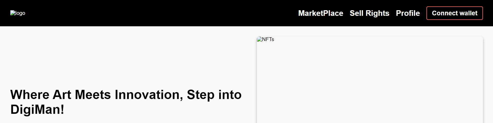
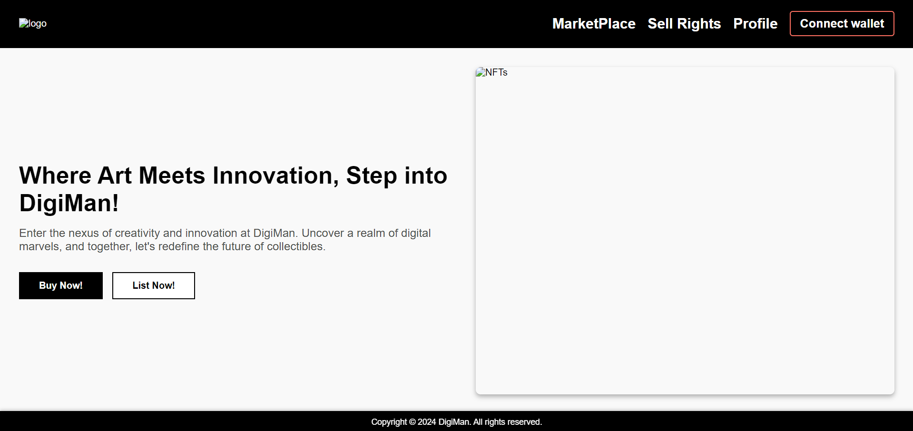
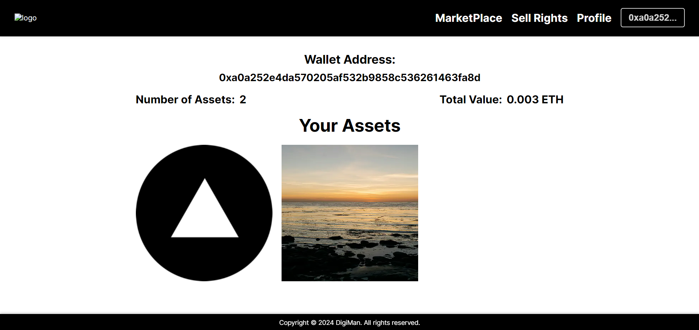
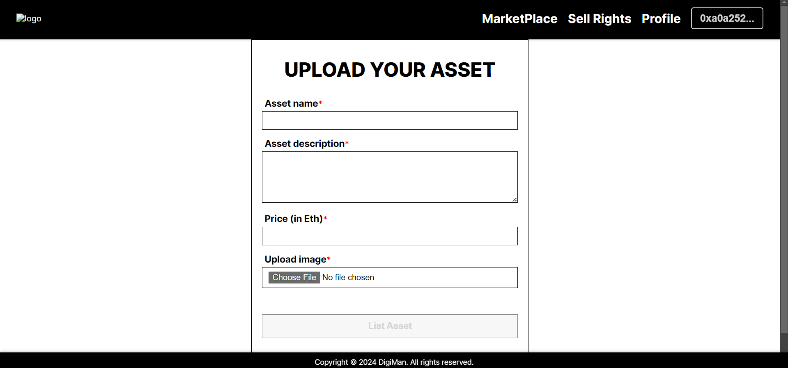
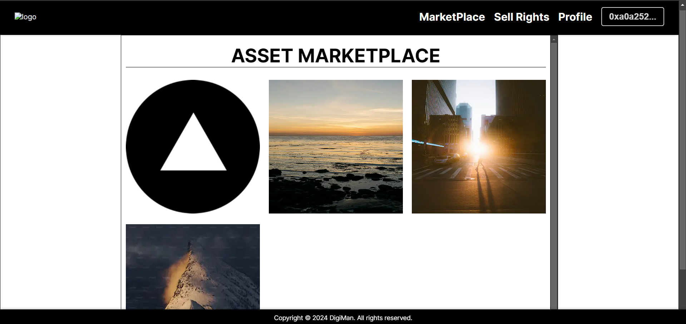
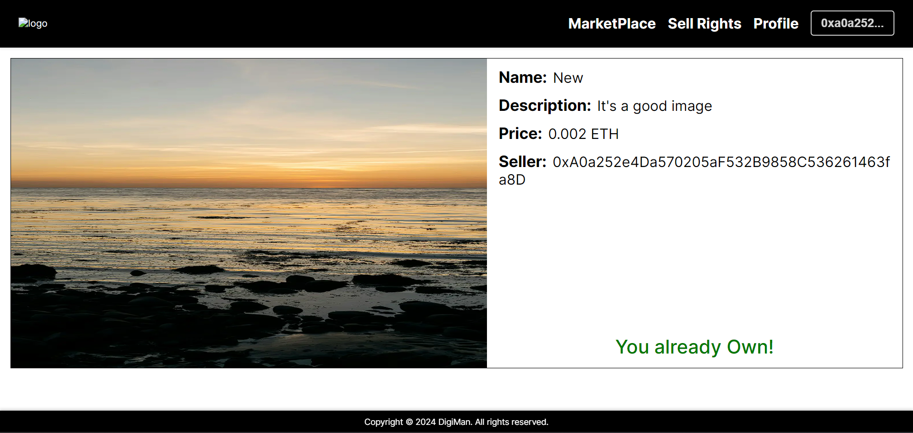

# DigiMan

## Overview

DigiMan is a decentralized platform for digital rights management, allowing users to sell and transfer ownership of digital assets using blockchain technology. Built with Hardhat and Next.js, DigiMan leverages the Holesky network to provide a secure and transparent environment for managing digital assets.

## Project Structure

- **/contracts**: Contains smart contracts.
- **/client**: Next.js frontend application.
- **/ignition**: Deployment and utility scripts.
- **/test**: Smart contract tests.
- **hardhat.config.js**: Hardhat configuration file.

## Features

- **Sell Digital Assets:** Users can list and sell their digital assets on the blockchain.
- **Purchase Assets:** Users can browse and buy digital assets listed by others.
- **Blockchain Integration:** Utilizes the Holesky network for secure and transparent transactions.

## Getting Started

### Prerequisites

- Node.js (v14 or higher)
- npm or yarn
- Hardhat
- MetaMask or another Ethereum wallet for interacting with the app

### Installation

1. **Clone the repository:**

   ```bash
   git clone https://github.com/nizrhm/digiman.git
   cd digiman

2. **Install Dependencies**

    First, install the project dependencies:

    ```bash
    npm install
    ```

**Next, navigate to the `client` directory and install the client-side dependencies:**

```bash
cd client
npm install
```

## Set Up Environment Variables

1. Create a `.env` file in the root directory based on the `.env.example` file.
2. Fill in the required environment variables (e.g., Holesky API URL, Private Key).

## Deployment

### Compile the Contracts

Compile the smart contracts with Hardhat:

```bash
npx hardhat compile
```

### Deploy the Contracts

Deploy the contracts to the Holesky network:

```bash
npx hardhat ignition deploy ./ignition/modules/Token.js --network holesky
```

## Run the Frontend

Navigate back to the `client` directory and start the development server:

```bash
cd client
npm run dev
```

## Running Tests

### Smart Contract Tests

Run tests for the smart contracts:

```bash
npx hardhat test
```

## Usage

1. Open the frontend in your browser at `http://localhost:3000`.
2. Connect your MetaMask wallet.
3. Start selling and purchasing digital assets directly from the application.

## Project Images








## License

This project is licensed under the MIT License.
```

You can save this content to a file named `README.md` or any other `.md` file for your project's documentation.